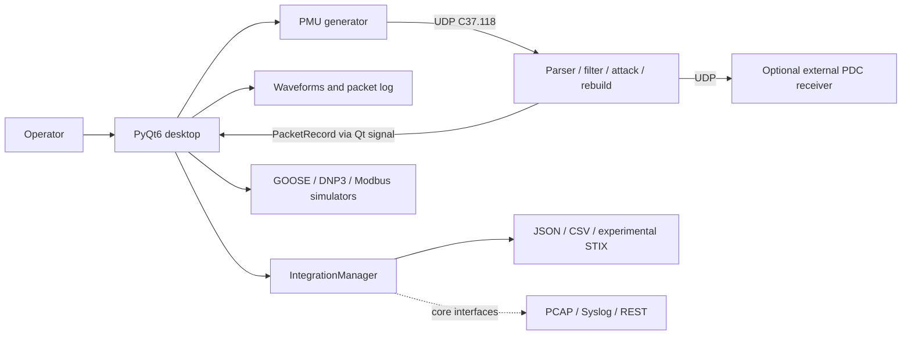
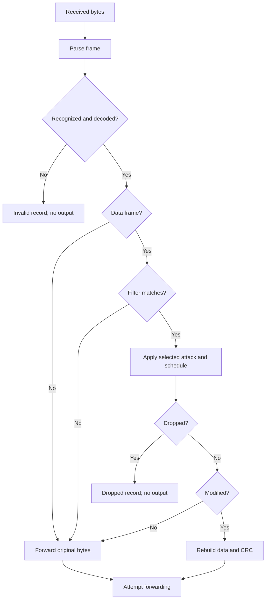

# Architecture

[Documentation index](index.md)

## System context

GridSec Sim is a local desktop application. It owns a synthetic PMU and a forwarding proxy; an external PDC, capture analyzer, or event collector is a separate system. No database, message broker, cloud backend, or web application is required.

The dotted path identifies core integration capabilities whose desktop wiring is incomplete. Auxiliary protocols are updated from original measurements, not the modified C37.118 values.

## Components and ownership

| Component | Responsibility and owned state |
|---|---|
| `main.py` | Dependency check, logging, Qt application, crash handler, demo scheduling |
| `MainWindow` | Runtime component handles, shared engine/filter, UI composition, Qt relay, integration manager |
| `TopologyCanvas` | Node/link collections, IDs, attachments, drawing and persistence |
| `PMUSimulator` | UDP generation thread, its own codec, measurement controls, send counters |
| `PDCProxy` | Receive/forward sockets, processing counters, callbacks, engine/filter references |
| `packet_parser` | Module-global active codec used for parse/rebuild |
| `AttackEngine` | Ten module instances, selected type, counters, schedule |
| `TrafficFilter` | Rules controlling which data frames enter the attack engine |
| `WaveformViewer` | Rolling measurement buffers and plot timer |
| `IntegrationManager` | In-memory incidents/packet summaries, session ID, export and integration configuration |
| `rest_api` | HTTP handler and module-global callback/auth/SSE state |

## Startup and shutdown

1. `main.py` configures logging and checks PyQt6, matplotlib, and numpy imports.
2. A `QApplication` and `MainWindow` are constructed. Background simulation has not started yet.
3. `--demo` schedules loading of the bundled topology.
4. Run validates the diagram and selects its first PMU and Local PDC.
5. The UDP proxy starts; the GUI waits 150 ms before starting the PMU. This is a fixed delay, not a readiness handshake.
6. The PMU sends a configuration frame, then data at the configured constructor rate, fixed to 30 frames/s by the GUI.
7. The GUI starts auxiliary GOOSE, DNP3, and Modbus components and plotting.
8. Stop requests component shutdown and stops plot updates. Closing a running main window invokes that simulation stop path.

Threads are daemon-based and components generally signal stop/close sockets rather than synchronously join every worker. The main window does not explicitly stop the integration manager on close. Embedders should manage integration lifecycle themselves and avoid immediate port reuse until workers exit.

## Proxy pipeline

`PacketRecord` is emitted during processing, before UDP forwarding is attempted. Thus a successful record or plot update is not a delivery acknowledgment. Send failures increment proxy errors. Rebuild failures can return the original raw bytes while the record remains classified as attacked.

Configuration and command frames bypass attack/filter processing once decoded. Unknown and invalid types are discarded. Scheduling counts matching data frames entering the engine, not all received packets.

## Threads and synchronization

PMU and proxy callbacks emit signals through `WorkerRelay`. Qt delivers connected UI work on the main thread. The GUI batches log updates every 200 ms, refreshes status every second, and updates attack statistics every 500 ms. The viewer redraws only its active tab at 10 Hz.

PMU measurement controls and integration record deques use locks. The engine is shared between UI and proxy without a comprehensive locking protocol. API callbacks execute on the server thread. Future remote control must marshal UI changes to Qt rather than manipulating widgets there.

The REST server runs `HTTPServer.serve_forever()` on a background thread. Request handling itself is single-threaded. An SSE connection occupies that handler until it ends and can prevent other requests from being served. Multiple server instances also share module-global state.

## State and persistence

- Topology JSON stores diagram state; loading it does not recreate a complete running session.
- Engine state survives stop/start within one main window unless reset.
- Integration incidents survive simulation stops and rotate when their bounded deque fills.
- There is no automatic session recovery, database persistence, or persistent integration-settings file.
- Parser codec and REST state are global within the Python process, limiting safe multi-stream/multi-server composition.

The parser defaults to zero digital words while the GUI PMU produces one. Passing `codec=` to `PDCProxy` does not update the parser's global codec. See [Known limitations](known-limitations.md) and the explicit `set_codec()` call in the offline example.

Source: [entry](../main.py), [main window](../gui/main_window.py), [proxy](../core/pdc_proxy.py), [parser](../core/packet_parser.py), [manager](../core/integration_manager.py), [REST](../core/rest_api.py).
